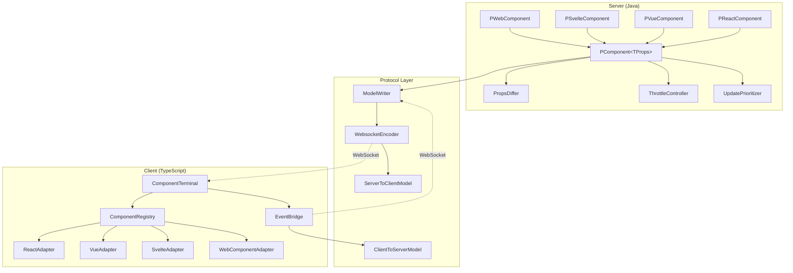

# Design Document: PComponent

## Overview

PComponent is a modern component system for PonySDK that replaces the legacy GWT-based PAddOn with a TypeScript-based solution. The architecture consists of three main layers:

1. **Server Layer (Java)**: Type-safe component classes with props diffing and throttling
2. **Protocol Layer**: Extended binary protocol for component messages
3. **Client Layer (TypeScript)**: Framework adapters for React, Vue, Svelte, and Web Components

The design prioritizes backward compatibility, allowing PComponent to coexist with existing PAddOn and GWT widgets during migration.

## Architecture



## Components and Interfaces

### Server-Side Components

#### PComponent Base Class

```java
public abstract class PComponent<TProps extends Record> extends PObject {
    
    private TProps currentProps;
    private TProps previousProps;
    private final PropsDiffer<TProps> differ;
    private final ThrottleConfig throttleConfig;
    private UpdatePriority priority = UpdatePriority.NORMAL;
    private FrameworkType frameworkType;
    
    protected PComponent(TProps initialProps, FrameworkType framework) {
        this.currentProps = initialProps;
        this.frameworkType = framework;
        this.differ = new PropsDiffer<>();
        this.throttleConfig = new ThrottleConfig();
    }
    
    protected void setProps(TProps newProps) {
        this.previousProps = this.currentProps;
        this.currentProps = newProps;
        scheduleUpdate();
    }
    
    protected abstract Class<TProps> getPropsClass();
    
    public void setThrottleInterval(long intervalMs) {
        throttleConfig.setInterval(intervalMs);
    }
    
    public void setPriority(UpdatePriority priority) {
        this.priority = priority;
    }
    
    public void onEvent(String eventType, Consumer<JsonObject> handler) {
        // Register event handler
    }
}
```

#### Framework-Specific Components

```java
public abstract class PReactComponent<TProps extends Record> 
    extends PComponent<TProps> {
    
    protected PReactComponent(TProps initialProps) {
        super(initialProps, FrameworkType.REACT);
    }
}

public abstract class PVueComponent<TProps extends Record> 
    extends PComponent<TProps> {
    
    protected PVueComponent(TProps initialProps) {
        super(initialProps, FrameworkType.VUE);
    }
}

public abstract class PSvelteComponent<TProps extends Record> 
    extends PComponent<TProps> {
    
    protected PSvelteComponent(TProps initialProps) {
        super(initialProps, FrameworkType.SVELTE);
    }
}

public abstract class PWebComponent<TProps extends Record> 
    extends PComponent<TProps> {
    
    protected PWebComponent(TProps initialProps) {
        super(initialProps, FrameworkType.WEB_COMPONENT);
    }
}
```

#### Props Differ

```java
public class PropsDiffer<TProps extends Record> {
    
    public Optional<List<JsonPatch>> computeDiff(TProps previous, TProps current) {
        if (previous == null) {
            return Optional.empty(); // Full JSON needed
        }
        
        JsonObject prevJson = toJson(previous);
        JsonObject currJson = toJson(current);
        
        List<JsonPatch> patches = JsonPatch.diff(prevJson, currJson);
        return patches.isEmpty() ? Optional.empty() : Optional.of(patches);
    }
    
    public byte[] computeBinaryDiff(TProps previous, TProps current) {
        // Binary encoding for high-frequency updates
    }
}
```

#### Throttle Controller

```java
public class ThrottleConfig {
    private long intervalMs = 0; // 0 = disabled
    private boolean enabled = false;
    
    public void setInterval(long intervalMs) {
        this.intervalMs = intervalMs;
        this.enabled = intervalMs > 0;
    }
    
    public boolean isEnabled() {
        return enabled;
    }
    
    public long getInterval() {
        return intervalMs;
    }
}

public class ThrottleController {
    private final Map<Integer, ScheduledUpdate> pendingUpdates = new ConcurrentHashMap<>();
    private final ScheduledExecutorService scheduler;
    
    public void scheduleUpdate(PComponent<?> component, Runnable updateAction) {
        ThrottleConfig config = component.getThrottleConfig();
        
        if (!config.isEnabled()) {
            updateAction.run();
            return;
        }
        
        int objectId = component.getID();
        pendingUpdates.compute(objectId, (id, existing) -> {
            if (existing != null && !existing.isExecuted()) {
                existing.setUpdateAction(updateAction); // Replace with latest
                return existing;
            }
            
            ScheduledUpdate scheduled = new ScheduledUpdate(updateAction);
            scheduler.schedule(() -> {
                scheduled.execute();
                pendingUpdates.remove(id);
            }, config.getInterval(), TimeUnit.MILLISECONDS);
            return scheduled;
        });
    }
}
```

#### Update Priority

```java
public enum UpdatePriority {
    HIGH(0),
    NORMAL(1),
    LOW(2);
    
    private final int order;
    
    UpdatePriority(int order) {
        this.order = order;
    }
    
    public int getOrder() {
        return order;
    }
}

public class UpdatePrioritizer {
    private final PriorityBlockingQueue<PendingUpdate> queue = 
        new PriorityBlockingQueue<>(100, 
            Comparator.comparingInt(u -> u.getPriority().getOrder()));
    
    public void enqueue(PComponent<?> component, Runnable update) {
        queue.offer(new PendingUpdate(component.getPriority(), update));
    }
    
    public void flush() {
        PendingUpdate update;
        while ((update = queue.poll()) != null) {
            update.execute();
        }
    }
}
```

### Client-Side Components (TypeScript)

#### Component Terminal

```typescript
interface ComponentMessage {
  objectId: number;
  type: 'create' | 'update' | 'destroy';
  framework?: FrameworkType;
  signature?: string;
  props?: unknown;
  patches?: JsonPatch[];
  binaryData?: ArrayBuffer;
}

class ComponentTerminal {
  private registry: ComponentRegistry;
  private eventBridge: EventBridge;
  
  constructor(websocket: WebSocket) {
    this.registry = new ComponentRegistry();
    this.eventBridge = new EventBridge(websocket);
  }
  
  handleMessage(message: ComponentMessage): void {
    switch (message.type) {
      case 'create':
        this.handleCreate(message);
        break;
      case 'update':
        this.handleUpdate(message);
        break;
      case 'destroy':
        this.handleDestroy(message);
        break;
    }
  }
  
  private handleCreate(message: ComponentMessage): void {
    const adapter = this.registry.createAdapter(
      message.objectId,
      message.framework!,
      message.signature!,
      message.props
    );
    adapter.mount();
  }
  
  private handleUpdate(message: ComponentMessage): void {
    const adapter = this.registry.get(message.objectId);
    if (!adapter) return;
    
    if (message.patches) {
      adapter.applyPatches(message.patches);
    } else if (message.binaryData) {
      adapter.applyBinary(message.binaryData);
    } else if (message.props) {
      adapter.setProps(message.props);
    }
  }
  
  private handleDestroy(message: ComponentMessage): void {
    const adapter = this.registry.get(message.objectId);
    if (adapter) {
      adapter.unmount();
      this.registry.remove(message.objectId);
    }
  }
}
```

#### Framework Adapters

```typescript
interface FrameworkAdapter<TProps = unknown> {
  mount(): void;
  unmount(): void;
  setProps(props: TProps): void;
  applyPatches(patches: JsonPatch[]): void;
  applyBinary(data: ArrayBuffer): void;
}

type FrameworkType = 'react' | 'vue' | 'svelte' | 'webcomponent';

class ComponentRegistry {
  private components = new Map<number, FrameworkAdapter>();
  private factories = new Map<string, ComponentFactory>();
  
  createAdapter(
    objectId: number,
    framework: FrameworkType,
    signature: string,
    initialProps: unknown
  ): FrameworkAdapter {
    const factory = this.factories.get(signature);
    if (!factory) {
      throw new Error(`No factory registered for: ${signature}`);
    }
    
    const adapter = this.createFrameworkAdapter(framework, factory, initialProps);
    this.components.set(objectId, adapter);
    return adapter;
  }
  
  private createFrameworkAdapter(
    framework: FrameworkType,
    factory: ComponentFactory,
    props: unknown
  ): FrameworkAdapter {
    switch (framework) {
      case 'react': return new ReactAdapter(factory, props);
      case 'vue': return new VueAdapter(factory, props);
      case 'svelte': return new SvelteAdapter(factory, props);
      case 'webcomponent': return new WebComponentAdapter(factory, props);
    }
  }
  
  get(objectId: number): FrameworkAdapter | undefined {
    return this.components.get(objectId);
  }
  
  remove(objectId: number): void {
    this.components.delete(objectId);
  }
}
```

#### React Adapter

```typescript
import { createRoot, Root } from 'react-dom/client';
import { applyPatch } from 'fast-json-patch';

class ReactAdapter<TProps> implements FrameworkAdapter<TProps> {
  private root: Root | null = null;
  private props: TProps;
  private component: React.ComponentType<TProps>;
  private container: HTMLElement;
  
  constructor(factory: ComponentFactory, initialProps: TProps) {
    this.component = factory.getReactComponent();
    this.props = initialProps;
    this.container = factory.getContainer();
  }
  
  mount(): void {
    this.root = createRoot(this.container);
    this.render();
  }
  
  unmount(): void {
    this.root?.unmount();
    this.root = null;
  }
  
  setProps(props: TProps): void {
    this.props = props;
    this.render();
  }
  
  applyPatches(patches: JsonPatch[]): void {
    this.props = applyPatch(this.props, patches).newDocument as TProps;
    this.render();
  }
  
  applyBinary(data: ArrayBuffer): void {
    // Decode binary and apply to props
    const decoded = this.decodeBinary(data);
    this.props = { ...this.props, ...decoded };
    this.render();
  }
  
  private render(): void {
    if (this.root) {
      this.root.render(React.createElement(this.component, this.props));
    }
  }
  
  private decodeBinary(data: ArrayBuffer): Partial<TProps> {
    // Binary decoding implementation
    return {} as Partial<TProps>;
  }
}
```

#### Event Bridge

```typescript
interface ComponentEvent {
  objectId: number;
  eventType: string;
  payload: unknown;
}

class EventBridge {
  private websocket: WebSocket;
  private pendingEvents: ComponentEvent[] = [];
  private flushScheduled = false;
  
  constructor(websocket: WebSocket) {
    this.websocket = websocket;
  }
  
  dispatch(objectId: number, eventType: string, payload: unknown): void {
    this.pendingEvents.push({ objectId, eventType, payload });
    this.scheduleFlush();
  }
  
  private scheduleFlush(): void {
    if (this.flushScheduled) return;
    this.flushScheduled = true;
    
    requestAnimationFrame(() => {
      this.flush();
      this.flushScheduled = false;
    });
  }
  
  private flush(): void {
    if (this.pendingEvents.length === 0) return;
    
    const message = this.encodeEvents(this.pendingEvents);
    this.websocket.send(message);
    this.pendingEvents = [];
  }
  
  private encodeEvents(events: ComponentEvent[]): ArrayBuffer {
    // Encode using ClientToServerModel protocol
    // Implementation follows existing PonySDK binary format
  }
}
```

### Protocol Extensions

#### ServerToClientModel Extensions

```java
// Add to existing ServerToClientModel enum
PCOMPONENT_CREATE(ValueTypeModel.NULL),
PCOMPONENT_UPDATE(ValueTypeModel.NULL),
PCOMPONENT_PROPS_FULL(ValueTypeModel.STRING),
PCOMPONENT_PROPS_PATCH(ValueTypeModel.STRING),
PCOMPONENT_PROPS_BINARY(ValueTypeModel.ARRAY),
PCOMPONENT_FRAMEWORK(ValueTypeModel.BYTE),
PCOMPONENT_SIGNATURE(ValueTypeModel.STRING),
```

#### ClientToServerModel Extensions

```java
// Add to existing ClientToServerModel enum
PCOMPONENT_EVENT("w"),
PCOMPONENT_EVENT_TYPE("x"),
PCOMPONENT_EVENT_PAYLOAD("y"),
```

#### WidgetType Extension

```java
// Add to existing WidgetType enum
COMPONENT((byte) XX) // Next available value
```

## Data Models

### Props Record Example

```java
public record ChartProps(
    String title,
    List<DataPoint> data,
    ChartOptions options
) {}

public record DataPoint(
    double x,
    double y,
    Optional<String> label
) {}

public record ChartOptions(
    String color,
    boolean showGrid,
    int animationDuration
) {}
```

### Generated TypeScript Interface

```typescript
// Auto-generated from ChartProps.java
export interface ChartProps {
  title: string;
  data: DataPoint[];
  options: ChartOptions;
}

export interface DataPoint {
  x: number;
  y: number;
  label?: string;
}

export interface ChartOptions {
  color: string;
  showGrid: boolean;
  animationDuration: number;
}

// Type guard
export function isChartProps(obj: unknown): obj is ChartProps {
  return (
    typeof obj === 'object' &&
    obj !== null &&
    'title' in obj &&
    'data' in obj &&
    'options' in obj
  );
}
```

### JSON Patch Format (RFC 6902)

```json
[
  { "op": "replace", "path": "/title", "value": "New Title" },
  { "op": "add", "path": "/data/-", "value": { "x": 5, "y": 10 } },
  { "op": "remove", "path": "/data/0" }
]
```

### Binary Update Format

For high-frequency updates (e.g., live charts), a compact binary format:

```
+--------+--------+--------+--------+
| FieldID| Type   | Length | Value  |
+--------+--------+--------+--------+
| 1 byte | 1 byte | 2 bytes| N bytes|
+--------+--------+--------+--------+
```

Field types:
- 0x01: int32
- 0x02: float64
- 0x03: string (UTF-8)
- 0x04: array start
- 0x05: array end


## Correctness Properties

*A property is a characteristic or behavior that should hold true across all valid executions of a system—essentially, a formal statement about what the system should do. Properties serve as the bridge between human-readable specifications and machine-verifiable correctness guarantees.*

### Property 1: Props Serialization Round-Trip

*For any* valid props object (Java Record), serializing to JSON then deserializing back to a props object SHALL produce an equivalent object.

**Validates: Requirements 3.5**

### Property 2: Props Diff Round-Trip

*For any* two valid props objects (previous and current), computing the JSON Patch diff from previous to current, then applying that patch to previous, SHALL produce an object equivalent to current.

**Validates: Requirements 1.3, 1.4, 3.1, 6.4**

### Property 3: No-Change Detection

*For any* props object, when setProps is called with an identical props object, THE PComponent SHALL not emit any update message.

**Validates: Requirements 3.2**

### Property 4: Throttle Batching Preserves Latest State

*For any* sequence of N rapid props updates (where N > 1) occurring within the throttle interval, THE PComponent SHALL send exactly one update containing only the final props state.

**Validates: Requirements 4.2**

### Property 5: Priority Ordering

*For any* queue containing updates with mixed priorities (HIGH, NORMAL, LOW), THE UpdatePrioritizer SHALL process all HIGH priority updates before any NORMAL updates, and all NORMAL updates before any LOW updates.

**Validates: Requirements 5.2**

### Property 6: Protocol Message Round-Trip

*For any* valid ComponentMessage, encoding to binary using the PonySDK protocol then decoding SHALL produce an equivalent message.

**Validates: Requirements 6.1, 10.3**

### Property 7: Framework Adapter Instantiation

*For any* valid component creation message with a framework type (React, Vue, Svelte, WebComponent), THE ComponentRegistry SHALL instantiate an adapter of the corresponding type.

**Validates: Requirements 2.5, 6.3**

### Property 8: Type Generation Correctness

*For any* valid Java Record definition, THE Type_Generator SHALL produce a TypeScript interface where:
- All Record fields map to interface properties
- Nested Records produce nested interfaces
- Java primitives map to TypeScript equivalents (int→number, String→string, boolean→boolean)
- Optional fields become optional properties (?)

**Validates: Requirements 8.1, 8.2, 8.3, 8.4**

### Property 9: Event Bridge Serialization

*For any* sequence of component events dispatched within the same animation frame, THE Event_Bridge SHALL:
- Batch all events into a single WebSocket message
- Include the correct objectId for each event
- Preserve event order within the batch

**Validates: Requirements 9.1, 9.2, 9.5**

### Property 10: JSON Patch Data Reduction

*For any* props update where only K fields change out of N total fields (where K < N), THE JSON Patch representation SHALL be smaller than the full JSON representation.

**Validates: Requirements 12.2**

### Property 11: Mount State Idempotence

*For any* component, calling mount() multiple times SHALL have the same effect as calling it once (no duplicate DOM elements, no errors). Similarly, calling unmount() on an already unmounted component SHALL have no effect.

**Validates: Requirements 11.5**

## Error Handling

### Server-Side Errors

| Error Condition | Handling Strategy |
|-----------------|-------------------|
| Props serialization failure | Log error, skip update, maintain previous state |
| Invalid props type (not a Record) | Compile-time error via generics constraint |
| Null props | Throw IllegalArgumentException at setProps |
| Component not attached | Queue updates until attachment |
| WebSocket disconnection | Buffer updates, retry on reconnection |
| Throttle scheduler failure | Fall back to immediate send |

### Client-Side Errors

| Error Condition | Handling Strategy |
|-----------------|-------------------|
| Unknown component signature | Log warning, ignore message |
| Invalid JSON Patch | Log error, request full props refresh |
| Framework adapter mount failure | Log error, mark component as failed |
| Binary decode failure | Log error, request JSON fallback |
| Event dispatch failure | Queue event, retry on next frame |

### Protocol Errors

| Error Condition | Handling Strategy |
|-----------------|-------------------|
| Unknown message type | Log warning, skip message |
| Malformed binary message | Log error, close and reconnect |
| Object ID not found | Log warning, ignore update |
| Version mismatch | Send version negotiation message |

### Recovery Strategies

1. **Props Resync**: If client detects inconsistency, request full props from server
2. **Component Recreation**: If adapter fails, destroy and recreate component
3. **Graceful Degradation**: Fall back to full JSON if patches fail repeatedly
4. **Circuit Breaker**: Disable throttling if updates consistently fail

## Testing Strategy

### Dual Testing Approach

This design requires both unit tests and property-based tests for comprehensive coverage:

- **Unit tests**: Verify specific examples, edge cases, integration points
- **Property tests**: Verify universal properties across all valid inputs

### Property-Based Testing Configuration

**Library**: jqwik (Java), fast-check (TypeScript)

**Configuration**:
- Minimum 100 iterations per property test
- Seed-based reproducibility for debugging
- Shrinking enabled for minimal failing examples

**Tag Format**: `Feature: pcomponent, Property {number}: {property_text}`

### Test Categories

#### Server-Side Tests (Java/jqwik)

| Test Type | Coverage |
|-----------|----------|
| Property: Props round-trip | Serialization correctness |
| Property: Diff round-trip | JSON Patch generation |
| Property: No-change detection | Update optimization |
| Property: Throttle batching | Throttle controller |
| Property: Priority ordering | Update prioritizer |
| Unit: Component lifecycle | Mount/unmount/destroy |
| Unit: Framework variants | PReactComponent, PVueComponent, etc. |
| Integration: Protocol encoding | Binary message format |

#### Client-Side Tests (TypeScript/fast-check)

| Test Type | Coverage |
|-----------|----------|
| Property: Message round-trip | Protocol parsing |
| Property: Patch application | JSON Patch handling |
| Property: Event batching | Event bridge |
| Property: Mount idempotence | Adapter lifecycle |
| Unit: React adapter | React-specific behavior |
| Unit: Vue adapter | Vue-specific behavior |
| Unit: Svelte adapter | Svelte-specific behavior |
| Unit: WebComponent adapter | Custom element behavior |
| Integration: Full flow | Server→Client→Server |

#### Type Generation Tests

| Test Type | Coverage |
|-----------|----------|
| Property: Type mapping | Java→TypeScript conversion |
| Property: Nested types | Complex record structures |
| Unit: Optional handling | Optional field conversion |
| Unit: Type guards | Runtime validation |

### Test Data Generators

```java
// Java - jqwik arbitrary for props
@Provide
Arbitrary<TestProps> testProps() {
    return Combinators.combine(
        Arbitraries.strings().alpha().ofMinLength(1).ofMaxLength(100),
        Arbitraries.integers(),
        Arbitraries.doubles(),
        Arbitraries.of(true, false)
    ).as(TestProps::new);
}
```

```typescript
// TypeScript - fast-check arbitrary for props
const testPropsArb = fc.record({
  title: fc.string({ minLength: 1, maxLength: 100 }),
  count: fc.integer(),
  value: fc.double(),
  enabled: fc.boolean()
});
```

### Coverage Goals

- **Line coverage**: ≥90% for core components
- **Branch coverage**: ≥85% for conditional logic
- **Property coverage**: 100% of documented properties
- **Integration coverage**: All message types, all frameworks
