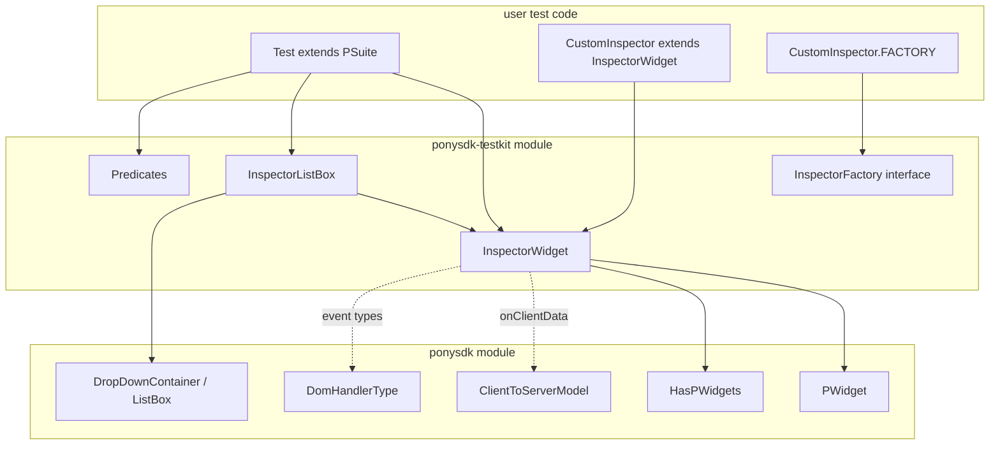

# Design: PonySDK UI TestKit

## Overview

The UI TestKit (`ponysdk-testkit`) is a standalone Gradle module providing a reflection-free, inspector-based API for testing PonySDK UI components. Test authors simulate user interactions (click, type, key press) and query widget state (text, styles, visibility) through a clean, composable API.

The design centers on `InspectorWidget` as the core abstraction — a non-final wrapper around any `PWidget`. Specialized inspectors like `InspectorListBox` extend this base and declare their own `InspectorFactory` that encapsulates both the base predicate (how to find the widget) and the constructor (how to wrap it). This factory pattern enables typed lookups without reflection.

All event simulation uses `PWidget.onClientData(JsonObject)` — the same path real browser events take — but this is an internal detail. The public API exposes typed methods (`click()`, `keyDown(int)`, `type(String)`) that build the JsonObject internally.

### Design Goals

- **Zero reflection**: All state access through public widget APIs, factory pattern for typed lookups
- **Explicit contracts**: Each inspector declares its factory with base predicate — no magic
- **Composable**: Predicates combine naturally; inspectors nest via typed `find()`
- **Extensible**: Users create custom inspectors by extending `InspectorWidget` and declaring a `FACTORY`
- **Compile-time safe**: Factory pattern catches errors at build time, not runtime
- **Descriptive failures**: When lookups fail, dump the visible hierarchy

## Architecture



### Module Structure

```
ponysdk-testkit/
├── build.gradle
└── src/main/java/com/ponysdk/test/inspector/
    ├── InspectorFactory.java
    ├── InspectorWidget.java
    ├── InspectorInfiniteScroll.java
    ├── InspectorListBox.java
    └── predicate/
        └── Predicates.java
```

## Components and Interfaces

### InspectorFactory (Typed Lookup Contract)

The interface that every specialized inspector implements to declare how it's found and constructed:

```java
package com.ponysdk.test.inspector;

import com.ponysdk.core.ui.basic.PWidget;
import java.util.function.Predicate;

/**
 * Contract for typed inspector lookup. Each specialized inspector exposes
 * a static FACTORY instance implementing this interface.
 *
 * @param <I> the inspector type
 */
public interface InspectorFactory<I extends InspectorWidget> {

    /**
     * The base predicate that identifies widgets this inspector can wrap.
     * For example, InspectorListBox returns style("dd-listbox").
     */
    Predicate<PWidget> basePredicate();

    /**
     * Creates an inspector instance wrapping the given widget.
     * @param widget the widget found by basePredicate (+ any extra predicates)
     */
    I create(PWidget widget);
}
```

### InspectorWidget (Core Contract)

```java
package com.ponysdk.test.inspector;

import com.ponysdk.core.model.DomHandlerType;
import com.ponysdk.core.ui.basic.PWidget;

import java.util.List;
import java.util.function.Predicate;

public class InspectorWidget {

    protected final PWidget widget;

    // === Construction ===

    public InspectorWidget(PWidget widget) { /* NPE if null */ }

    public static InspectorWidget of(PWidget widget) { return new InspectorWidget(widget); }

    // === State Queries ===

    public String getText() { ... }
    public boolean isVisible() { ... }
    public boolean isEnabled() { ... }
    public boolean hasStyle(String styleName) { ... }
    public PWidget getWidget() { return widget; }

    // === Generic Traversal ===

    /** Find first visible descendant matching predicate. Throws AssertionError if not found. */
    public InspectorWidget find(Predicate<PWidget> predicate) { ... }

    /** Find all visible descendants matching predicate. */
    public List<InspectorWidget> findAll(Predicate<PWidget> predicate) { ... }

    /** Returns true if any visible descendant matches. */
    public boolean has(Predicate<PWidget> predicate) { ... }

    // === Typed Traversal (Factory-based) ===

    /**
     * Find the first widget matching the factory's base predicate (+ optional extras)
     * and wrap it in the specialized inspector.
     *
     * Usage:
     *   InspectorListBox lb = inspector.find(InspectorListBox.FACTORY);
     *   InspectorListBox lb = inspector.find(InspectorListBox.FACTORY, position(2));
     *   InspectorListBox lb = inspector.find(InspectorListBox.FACTORY, attr("aria-label", "account"));
     */
    @SafeVarargs
    public final <I extends InspectorWidget> I find(InspectorFactory<I> factory,
                                                     Predicate<PWidget>... extraPredicates) {
        Predicate<PWidget> combined = factory.basePredicate();
        for (Predicate<PWidget> extra : extraPredicates) {
            combined = combined.and(extra);
        }
        PWidget found = findWidget(combined); // internal recursive search
        return factory.create(found);
    }

    /**
     * Find all widgets matching the factory's base predicate (+ optional extras).
     */
    @SafeVarargs
    public final <I extends InspectorWidget> List<I> findAll(InspectorFactory<I> factory,
                                                              Predicate<PWidget>... extraPredicates) { ... }

    // === User Actions (fluent, return this) ===

    public InspectorWidget click() { checkEnabled(); fireEvent(DomHandlerType.CLICK); return this; }
    public InspectorWidget doubleClick() { checkEnabled(); fireEvent(DomHandlerType.DOUBLE_CLICK); return this; }
    public InspectorWidget keyDown(int keyCode) { checkEnabled(); fireEvent(DomHandlerType.KEY_DOWN, keyCode); return this; }
    public InspectorWidget keyUp(int keyCode) { checkEnabled(); fireEvent(DomHandlerType.KEY_UP, keyCode); return this; }
    public InspectorWidget focus() { fireEvent(DomHandlerType.FOCUS); return this; }
    public InspectorWidget blur() { fireEvent(DomHandlerType.BLUR); return this; }

    /** Type text in one shot (single value change event). */
    public InspectorWidget type(String text) { return type(text, false); }

    /**
     * Type text.
     * @param characterByCharacter true = KEY_DOWN + progressive value change + KEY_UP per char
     *                             false = single HANDLER_STRING_VALUE_CHANGE with full text
     */
    public InspectorWidget type(String text, boolean characterByCharacter) { ... }

    // === Protected Extension Points ===

    /** Fire a DOM event. Subclasses use this for custom interactions. */
    protected void fireEvent(DomHandlerType type) { ... }

    /** Fire a DOM event with a key code. */
    protected void fireEvent(DomHandlerType type, int keyCode) { ... }

    /** Fire a value change event. */
    protected void fireValueChange(String value) { ... }

    /** Check widget is enabled; throws AssertionError if not. */
    protected void checkEnabled() { ... }

    /** Build a text dump of the visible hierarchy for error messages. */
    protected String dumpHierarchy() { ... }
}
```

**Key design decisions:**

1. **`find(InspectorFactory, extraPredicates...)`** — the factory provides the base predicate, extras are AND-combined. No reflection needed.
2. **Action methods return `this`** — fluent chaining: `inspector.click().type("hello").blur()`
3. **Protected extension points are typed** — `fireEvent(DomHandlerType)`, `fireEvent(DomHandlerType, int)`, `fireValueChange(String)`. No raw JsonObject in the API.
4. **`getText()` uses polymorphic dispatch** — checks widget type and extracts text accordingly.
5. **`checkEnabled()` before every action** — consistent error behavior.

### InspectorListBox

```java
package com.ponysdk.test.inspector;

import com.ponysdk.core.ui.basic.PWidget;
import com.ponysdk.test.inspector.predicate.Predicates;

import java.util.List;
import java.util.function.Predicate;

public class InspectorListBox extends InspectorWidget {

    /** Factory for typed lookup. Matches widgets with style "dd-listbox". */
    public static final InspectorFactory<InspectorListBox> FACTORY = new InspectorFactory<>() {
        @Override
        public Predicate<PWidget> basePredicate() {
            return Predicates.style("dd-listbox");
        }

        @Override
        public InspectorListBox create(PWidget widget) {
            return new InspectorListBox(widget);
        }
    };

    public InspectorListBox(PWidget widget) { super(widget); }

    /**
     * Opens the dropdown: clicks the button + triggers InfiniteScroll render
     * so items are immediately available for selection.
     * This is the "just works" path — no need to think about InfiniteScroll.
     */
    public InspectorListBox open() {
        find(Predicates.style("dd-container-button")).click();
        getInfiniteScroll().simulateFullRender();
        return this;
    }

    /** Closes the dropdown. */
    public InspectorListBox close() { ... }

    /** Whether the dropdown is open. */
    public boolean isOpen() {
        return hasStyle("dd-container-opened");
    }

    /**
     * Opens dropdown, clicks items matching each label, closes.
     * @throws AssertionError if label not found (lists available labels)
     */
    public InspectorListBox select(String... labels) { ... }

    /** Labels of currently selected items. */
    public List<String> getSelectedLabels() { ... }

    /** All available item labels in the dropdown. */
    public List<String> getAvailableLabels() { ... }

    /** Types into the search/filter input. */
    public InspectorListBox filter(String text) { ... }

    /** Clicks the clear button (multi-select mode). */
    public InspectorListBox clear() {
        find(Predicates.style("dd-listbox-clear-multi")).click();
        return this;
    }

    /**
     * Access the InfiniteScroll inspector for advanced scenarios
     * (pagination testing, scroll simulation, partial renders).
     */
    public InspectorInfiniteScroll getInfiniteScroll() { ... }
}
```

### InspectorInfiniteScroll

Inspector for `InfiniteScrollAddon` — handles simulation of client-side scroll/render events.
Used by composition in `InspectorListBox` (and any other widget using InfiniteScroll).

```java
package com.ponysdk.test.inspector;

import com.ponysdk.core.ui.basic.PWidget;

import java.util.function.Predicate;

public class InspectorInfiniteScroll extends InspectorWidget {

    public static final InspectorFactory<InspectorInfiniteScroll> FACTORY = new InspectorFactory<>() {
        @Override
        public Predicate<PWidget> basePredicate() {
            return w -> w.getAddons() != null && w.getAddons().stream()
                .anyMatch(a -> a.getClass().getSimpleName().equals("InfiniteScrollAddon"));
        }

        @Override
        public InspectorInfiniteScroll create(PWidget widget) {
            return new InspectorInfiniteScroll(widget);
        }
    };

    public InspectorInfiniteScroll(PWidget widget) { super(widget); }

    /**
     * Simulates the JS client requesting a page of items.
     * Triggers InfiniteScrollProvider.getData(beginIndex, maxSize, filter).
     */
    public void simulateRender(int beginIndex, int maxSize) { ... }

    /**
     * Simulates a full render: calls getFullSize() then getData(0, fullSize).
     * This is what open() calls by default — renders all items at once.
     */
    public void simulateFullRender() { ... }
}
```

### PAddon Event Simulation (No PonySDK modification needed)

`PAddon` instances receive client events through `onClientData()` on their host widget — the same mechanism as regular DOM events. The testkit simply constructs the appropriate `JsonObject` matching what the JS addon would send, and calls `widget.onClientData()`.

For `InfiniteScrollAddon`, the JS client sends scroll/render requests as JSON. The `InspectorInfiniteScroll` replicates this:

```java
// Inside InspectorInfiniteScroll.simulateRender():
JsonObject renderRequest = Json.createObjectBuilder()
    .add("beginIndex", beginIndex)
    .add("maxSize", maxSize)
    .build();
getWidget().onClientData(renderRequest);  // triggers the addon's terminalHandler
```

No PonySDK source modification required. The testkit uses the existing `onClientData` dispatch path.
```

**Usage examples:**

```java
// === Simple (default behavior — just works) ===

InspectorWidget panel = InspectorWidget.of(myPanel);
InspectorListBox lb = panel.find(InspectorListBox.FACTORY);
lb.select("Option A");  // open() + simulateFullRender + click item + close
assertEquals(List.of("Option A"), lb.getSelectedLabels());

// === Find specific ListBox ===

InspectorListBox accountLb = panel.find(InspectorListBox.FACTORY, attr("aria-label", "account"));
InspectorListBox thirdLb = panel.find(InspectorListBox.FACTORY, position(2));

// === Advanced — test pagination/scroll behavior ===

InspectorListBox lb = panel.find(InspectorListBox.FACTORY);
lb.open();
// Only render first 10 items (simulate partial scroll)
lb.getInfiniteScroll().simulateRender(0, 10);
assertEquals(10, lb.getAvailableLabels().size());
// Scroll to next page
lb.getInfiniteScroll().simulateRender(10, 10);
lb.close();

// === Custom inspector for a proprietary widget ===

public class InspectorPriceSpinner extends InspectorWidget {
    public static final InspectorFactory<InspectorPriceSpinner> FACTORY = new InspectorFactory<>() {
        public Predicate<PWidget> basePredicate() { return Predicates.style("price-spinner"); }
        public InspectorPriceSpinner create(PWidget w) { return new InspectorPriceSpinner(w); }
    };

    public InspectorPriceSpinner(PWidget widget) { super(widget); }
    public void increment() { find(Predicates.style("btn-up")).click(); }
    public void decrement() { find(Predicates.style("btn-down")).click(); }
    public String getValue() { return find(Predicates.style("value-display")).getText(); }
}

// In tests:
InspectorPriceSpinner spinner = panel.find(InspectorPriceSpinner.FACTORY);
spinner.increment();
assertEquals("101.5", spinner.getValue());
```

### Predicates

```java
package com.ponysdk.test.inspector.predicate;

import com.ponysdk.core.ui.basic.PWidget;
import java.util.function.Predicate;

public final class Predicates {

    private Predicates() {}

    /** Matches widgets with ALL specified style names. */
    public static Predicate<PWidget> style(String... styleNames) { ... }

    /** Matches widgets that are instances of the specified class. */
    public static <T extends PWidget> Predicate<PWidget> type(Class<T> widgetClass) { ... }

    /** Matches widgets whose text equals the specified string. */
    public static Predicate<PWidget> text(String expectedText) { ... }

    /** Matches widgets with the specified debug ID. */
    public static Predicate<PWidget> debugId(String id) { ... }

    /** Matches widgets with the specified attribute value. */
    public static Predicate<PWidget> attr(String name, String value) { ... }

    /** Matches the Nth widget (0-based) among those satisfying the composed predicate. */
    public static Predicate<PWidget> position(int index) { ... }
}
```

All predicates override `toString()` for error messages (e.g., `"style(dd-listbox, active)"`).

## Data Models

### Event Simulation (Internal)

All event construction is internal to `InspectorWidget`. The public API never exposes `JsonObject`:

| Method | Internal JsonObject |
|---|---|
| `click()` | `{DOM_HANDLER_TYPE: CLICK}` |
| `doubleClick()` | `{DOM_HANDLER_TYPE: DOUBLE_CLICK}` |
| `keyDown(code)` | `{DOM_HANDLER_TYPE: KEY_DOWN, VALUE_KEY: code}` |
| `keyUp(code)` | `{DOM_HANDLER_TYPE: KEY_UP, VALUE_KEY: code}` |
| `focus()` | `{DOM_HANDLER_TYPE: FOCUS}` |
| `blur()` | `{DOM_HANDLER_TYPE: BLUR}` |
| `type(text, false)` | `{HANDLER_STRING_VALUE_CHANGE: text}` |
| `type(text, true)` | Per char: `{KEY_DOWN, key}` + `{VALUE_CHANGE: progressive}` + `{KEY_UP, key}` |

### Text Extraction

| Widget Type | Source |
|---|---|
| `PLabel` | `getText()` |
| `PButtonBase` | `getText()` |
| `PTextBoxBase` | `getText()` |
| `PHTML` | `getHTML()` |
| `PCheckBox` | `getText()` |
| `PElement` | `getInnerText()` |
| Other | `null` |

### Hierarchy Dump (Error Messages)

```
Widget not found matching: style(my-button)
Visible hierarchy:
  PFlowPanel [dd-container]
    PButton [dd-container-button] text="Select..."
    PButton [dd-container-state]
  PFlowPanel [dd-container-addon]
    PFlowPanel [dd-listbox-filter]
      PTextBox text=""
```

## Correctness Properties

### Property 1: Inspector wrapping round-trip
For any PWidget, `InspectorWidget.of(w).getWidget() == w` (reference equality).

### Property 2: getText() correctness
For any widget with text set to string S, `InspectorWidget.of(w).getText()` returns S.

### Property 3: State delegation
`isVisible()`, `isEnabled()`, `hasStyle()` return values consistent with the widget's actual state.

### Property 4: find() locates first visible match
For any tree with at least one visible match, `find(predicate)` returns the first in depth-first order.

### Property 5: findAll() returns all visible matches
`findAll(predicate)` returns exactly the set of all visible descendants satisfying the predicate.

### Property 6: has() equivalence
`has(p)` returns true iff `findAll(p)` is non-empty.

### Property 7: find() failure is descriptive
When no match exists, `find()` throws AssertionError containing predicate description + hierarchy dump.

### Property 8: Invisible subtrees excluded
Invisible containers and their children are never returned by traversal.

### Property 9: style() predicate correctness
`style(names).test(w)` is true iff widget has ALL specified style names.

### Property 10: Predicate composition
`p1.and(p2)`, `p1.or(p2)`, `p1.negate()` follow standard boolean logic.

### Property 11: Typed find combines predicates correctly
`find(factory, extras...)` matches widgets satisfying `factory.basePredicate().and(extra1).and(extra2)...`

### Property 12: click() fires handler
For any enabled widget with a click handler, `click()` invokes that handler exactly once.

### Property 13: keyDown()/keyUp() fires with correct code
Key events carry the exact key code passed to the method.

### Property 14: type(text, false) sets value
After `type(s, false)`, the widget's text equals s.

### Property 15: type(text, true) fires per-character events
For string of length N, fires exactly N × (KEY_DOWN + VALUE_CHANGE + KEY_UP) sequences.

### Property 16: Disabled widget throws on action
Any action on a disabled widget throws AssertionError.

### Property 17: ListBox select round-trip
`select(labels)` followed by `getSelectedLabels()` returns exactly those labels.

## Error Handling

| Scenario | Behavior |
|---|---|
| `InspectorWidget.of(null)` | `NullPointerException` |
| `find()` no match | `AssertionError` with predicate + hierarchy dump |
| `find(factory)` no match | `AssertionError` with factory predicate + extras + hierarchy dump |
| Action on disabled widget | `AssertionError`: "Cannot interact with disabled widget" |
| `select()` unknown label | `AssertionError` listing available labels |
| `filter()` search not enabled | `AssertionError`: "Search is not enabled on this ListBox" |
| `clear()` no clear button | `AssertionError`: "Clear button is not available" |

## Testing Strategy

- **Property-based tests** (jqwik): Properties 1-17 with arbitrary widget trees, style sets, text strings
- **Unit tests**: Specific widget types, InspectorListBox lifecycle, PSuite integration, custom inspector extension
- **Test location**: `ponysdk-testkit/src/test/java/com/ponysdk/test/inspector/`
